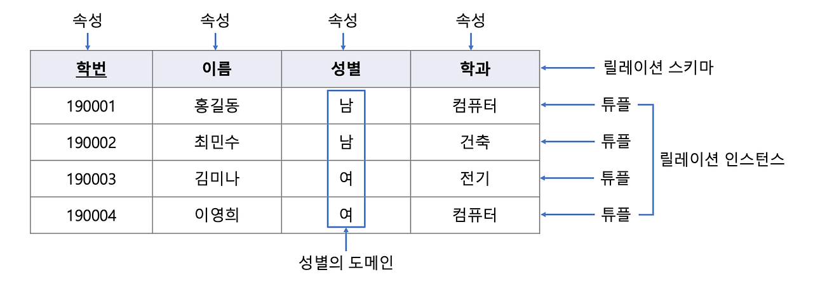

# 4.1 데이터 베이스의 기본 

> Q. 데이터 베이스란? 

A. 데이터 베이스는 일정한 규칙, 혹은 규약을 통해 구조화 되어 저장되는 데이터의 모음이다. 

데이터베이스 안에 있는 데이터들은 쿼리 언어(query language)를 통해 삽입, 삭제, 수정, 조회 등을 수행할 수 있다. 또한 실시간 접근과 동시 공유가 가능하다. 

데이터베이스 위에 DBMS, 그 위에 응용 프로그램(Node.js나 php같은)이 있어 해당 구조와 같은 형태로 데이터를 주고받는다. 

## 4.1.1 엔터티

> Q. 엔터티란 무엇인가?

A. 엔터티란 사람, 장소, 물건, 사건, 개념 등 여러개의 속성을 지닌 명사로 저장을 위한 Thing에 해당한다.

예를 들어 어떤 회원(엔터티)은 이름, 아이디, 주소, 전화번호의 속성을 가지게 된다.

> Q. 엔터티의 특징은 무엇이 있는가?

A. 
1 ) 반드시 해당 업무에서 필요하고 관리하고자 하는 정보이다.

2 ) 유일한 식별자에 의해 식별이 가능해야한다. 

3 ) 영속적으로 존재하는 인스턴스의 집합이어야 한다.(2개 이상)

4 ) 반드시 속성이 있어야 한다 

5 ) 엔터티는 다른 엔터티와 최소 한개 이상의 관계가 있어야 한다. 

## 4.1.2 릴레이션

> Q. 릴레이션이란 무엇인가?

A. 릴레이션은 데이터베이스에서 정보를 구분하여 저장하는 기본 단위. 
릴레이션을 관계형 데이터베이스에서는 테이블이라고 하고, NoSQL에선 컬렉션이라고 한다. 

> Q. RDBMS vs NoSQL

RDBMS란 스키마를 사전에 정의해야한다. 스키마란 데이터베이스 내에서 데이터가 어떤 구조로 저장되는 것인지 나타내는 것이다. 이름, 필드, 데이터 유형, 엔티티간의 관계 등 논리적 제약조건등이 이에 해당된다. 

NoSQL란 Not only SQL의 약자로 비관계형 데이터베이스를 의미한다. 스키마가 필요 없이 작업과 동시에 데이터를 정의하는 방식으로 빠르게 데이터를 작성하고 반복할 수 있다. 

온라인 게이밍, 전자상거래 웹 애플리케이션 등 대량의 데이터+낮은 대기시간, 응답시간을 요구하는 앱 구축에 사용된다. 
그러나 쿼리가 복잡해지게 되면 복잡한 조인, 하위쿼리, 중첩질의를 제공하지 않기 때문에 이럴땐 RDBMS가 좋은 선택지가 된다. 

## 4.1.3 속성

> Q. 속성이란 무엇인가?

A. 릴레이션에서 관리하는 구체적이며 고유한 이름을 갖는 정보이다. 

'차'라는 엔티티의 속성으로는 차 넘버, 바퀴수, 차 색깔등이 있다. 
이중 관리할 필요가 있는 속성만 엔터티의 속성이 된다. 

## 4.1.4 도메인

>Q. 도메인이란 무엇인가?

A. 릴레이션에 포함된 각각의 속성들이 가질 수 있는 값의 집합을 말한다. 

'차'라는 엔터티의 속성의 바퀴 수로 가질 수 있는 값은 {2, 4}라는 도메인(집합)이 된다. 

## 4.1.5 필드와 레코드 

> Q. 필드는 무엇인가?

## 4.1.6 관계

## 4.1.7 KEY

