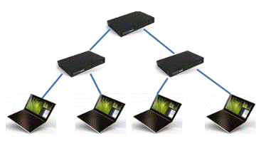
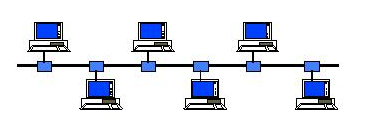
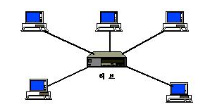
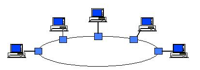
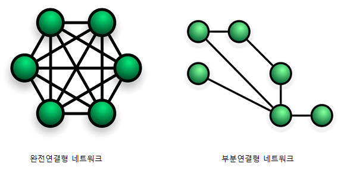
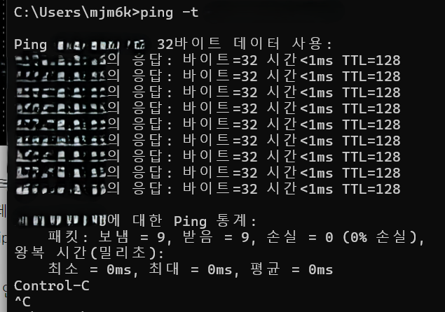
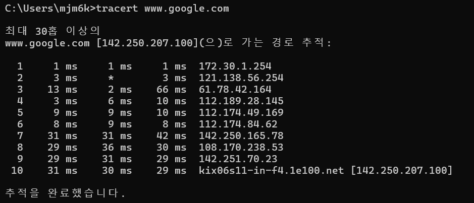

# 2.1 네트워크의 기초

> Q. 네트워크란? 

A. 네트워크란 노드와 링크가 서로 연결되어있거나 연결되어있지 않은 집합체를 의미한다. 

- 노드 : 서버, 라우터, 스위치 등의 네트워크 장비. 
- 링크 : 유선, 무선 

## 2.1.1 처리량과 지연시간 

> Q. 좋은 네트워크란 무엇인가?

A. 아래 4가지로 정리할 수 있다. 

1) 많은 처리량을 처리할 수 있어야 한다. 
  - 처리량(throughput)이란 링크를 통해 전달되는 단위 시간당 데이터양을 의미한다(평균값). 트래픽, 네트워크 장치간의 대역폭, 네트워크 중간에 발생하는 에러, 장치의 하드웨어 스펙에 영향을 받는다. 
  - 단위 : bps ( 초당 전송 또는 수신되는 비트수 )
  - 대역폭은 주어진 시간에 네트워크를 통과할 수 있는 데이터의 양을 측정하는 척도로 단위가 mbps나 gbps이다. 
2) 지연시간이 짧다.
  - 지연시간(latency)이란, 요청이 처리되는 시간을 말하며 어떤 메세지가 두 장치사이를 왕복하는데 걸린 시간을 말한다. 네트워크 진단 툴인 'ping'명령을 실행하는데 그래서 속도테스트에서 지연시간을 핑속도라고 한다. 
  - 데이터가 이동해야 하는 거리, 매채 타입 (유무선, 광섬유 케이블이 무선보다 짧겠지), 패킷 크기, 라우터의 패킷 처리 시간 등에 영향을 받는다.
  - 지연시간을 줄이기 위해서는 
      1. 전세계에 데이터를 배포할 때 CDN(콘텐츠 전송 네트워크)을 사용한다. 
      2. 캐시된 콘텐츠 제공 이상의 서비스를 제공할 때 엣지 컴퓨팅을 사용한다. 
      3. 서브넷을 사용한다. 서브넷은 네트워크 내부의 더 작은 네트워크이며 비효율적인 라우팅을 줄이고 지연시간을 단축시킬 수 있다. 
      4. 대역폭을 증가시킨다. 
  
3) 장애 빈도가 적다.
4) 좋은 보안을 갖춘 네트워크. 

## 2.1.2 네트워크와 토폴로지 병목 현상 

> Q. 네트워크 토폴로지에 대해 설명하라. 

A. 네트워크 토폴로지란 (network topology) 노드와 링크가 어떻게 배치되어 있는지에 대한 방식이자 연결 형타를 의미한다. 

1. 트리 토폴로지 : 계층형 토폴로지라고 하며 트리 형태로 배치한 네트워크 구성을 말한다. 노드의 추가삭제가 쉽다. 

  
  
  
  - 응용 : 케이블 TV

2. 버스 토폴로지 : 중앙 통신회선 하나에 여러개의 노드가 연결되어 공유하는 네트워크 구성을 말하며 근거리 통신망(LAN)에서 사용한다. 스푸핑의 문제가 있따. 
  - 스푸핑 : LAN상에서 송신부의 패킷을 송신과 관련없는 다른 호스트에게 가지 않도록 하는 스위칭 기능을 마비시키거나 속여서 특정 노드에 해당 패킷이 오도록 처리하는 것을 말한다.
  - 응용 : 사무실의 LAN

3. 스타 토폴로지 : 중앙에 있는 노드에 모두 연결된 네트워크 구성. 노드추가, 에러탐지가 쉽고 패킷의 충돌 가능성이 적다. 그러나 중앙 노드에 장애가 발생하면 전체 네트워크를 사용할 수 없다. 고가의 토폴로지 
  - 응용 : 은행C/S, 전화교환망, 이더넷
- 

4. 링형 토폴로지 : 각각의 노드가 양 옆의 두 노드와 연결하여 전체적으로 고리처럼 하나의 연속된 길을 통해 통신을 하는 망 구성방식. 네트워크 구성 변경이 어렵고 회선에 장애가 발생하면 전체 네트워크에 영향을 크게  끼친다. 시간오차가 적고 실시간 반응이 빠르다. 근데 망가지면 다 못쓰기 때문에 이중링을 사용한다. 
  - 응용 : RPR(이더넷 기술 기반의 인터넷 트래픽을 효율적으로 처리할 수 있도록 IEEE에서 표준화시킨 기술. 주로 링형 구조로 연결이 되며 소스 노드로부터 전송된 프레임은 목적지 노드에서 제거되고 그만큼의 대역폭을 다른 노드들이 사용 가능하다. ), 스마트팩토리

5. 메시 토폴로지 : 망형 토폴로지라고도 하며 그물망처럼 연결되어있는 구조이다. 한 단말기에 장애가 발생해도 네트워크를 계속 사용할 수 있고, 트래픽도 분산처리가 가능하다. 그러나 노드의 추가가 어렵고 구축과 운영 비용이 고가이다. 
  - 응용 : 인터넷 

> Q. 물리적 토폴로지와 논리적 토폴로지에 대해 설명해라 

A. 물리적 네트워크 토폴로지는 다양한 네트워크 구성 요소의 배치이다. 논리적 네트워크 토폴로지는 데이터가 네트워크 내에서 어떻게 이동하는지를 상위 수준에서 표시한다. 

> Q. 토폴로지가 중요한 이유는 무엇인가?

A. 병목현상을 찾을 때 중요한 기준이 되기 때문이다. 
- 병목현상 : 전체 시스템의 성능이나 용량이 하나의 구성요소로 인해 제한을 받는 현상을 말한다. 네트워크 속도가 제한되는 지점. 

> Q. 네트워크 병목현상의 주된 원인들은 무엇이 있는가?

A. (대역폭, 토폴로지, 서버 CPU, 메모리)
네트워크 대역폭이 작거나, 네트워크 토폴로지의 문제, 서버의 CPU, 메모리 사용량과 같은 하드웨어적 문제 등이 있다.
이러한 병목 현상이 나타나면 네트워크 관련 테스트와 네트워크와 무관한 테스트를 통해 해당 문제가 네트워크로부터 발생하는 문제점인지를 확인하는 절차가 필요하다.

## 2.1.3 네트워크 분류 

> Q. 규모를 기반으로 네트워크를 분류해 보아라 

A. 3가지 LAN, MAN, WAN으로 나눌 수 있다. 

1. LAN (근거리 통신망)
  - 같은 건물이나 캠퍼스와 같은 좁은 공간에서 운영된다. 
  - 전송 속도가 빠르고 혼잡하지 않다 

2. MAN (대도시 지역 네트워크)
  - 도시같은 넓은 공간에서 운영된다. 
  - 전송속도는 평균이고 LAN보다 혼잡하다 

3. WAN (광역 네트워크)
  - 대륙같은 공간에서 운영된다. 
  - 전송속도는 낮으며 MAN보다 혼잡하다. 

## 2.1.4 네트워크 성능 분석 명령어 

> Q. 분석 명령어는 왜 필요한가?

A. 병목현상이 발생했을 때, 네트워크 관련 테스트와 네트워크와 무관한 테스트를 통해 '네트워크에서 발생한 문제점'인것을 확인해야 한다. 따라서 네트워크 성능 분석을 위해 분석 명령어가 필요하다. 

> Q. Ping에 대해 설명해라 

A. Ping은 Packet INternet Groper로 네트워크 상태를 확인하려는 대상 노드를 향해 일정 크기의 패킷을 전송하는 명령어이다. 수신상태와 도달 시간을 알 수 있으며 네트워크가 잘 연결되어있는지 확인할 수 있다. 

`ping 127.0.0.1 -n 12` : 12번 패킷 보내고 받도록 옵션 넣기 

TCP/IP 프로토콜 중에 ICMP프로토콜을 통해 동작하며, 이때문에 ICMP 프로토콜을 지원하지 않는 기기를 대상으로는 실행할 수 없거나 네트워크 정책상 ICMP나 traceroute를 차단하는대상의 경우 ping테스팅은 불가능하다. 

- ICMP란 ? 인터넷 제어 메세지 프로토콜로 프로토콜 네트워크 장치에서 네트워크 통신문제를 진단하는데 사용되는 네트워크 계층 프로토콜이다. 

> Q. Netstat에 대해 설명하라 

A. 접속되어 있는 서비스들의 네트워크 상태를 보여준다. 네트워크 접속, 라우팅테이블, 네트워크 프로토콜등의 리스트를 보여준다. 

서비스의 포트가 열려있는지를 확인할 떄 사용한다. 

> Q. nslookup에 대해 설명하라 

A. DNS에 관련된 내용을 확인하기 위해 쓰는 명령어이다. 

- [DNS](https://velog.io/@zinukk/9kpyzbdt) : 도메인 네임 시스템. 사람이 읽을 수 있는 도메인이름을 기계가 읽을 수 있는 IP주소로 변환하는 것. 

> Q. tracert에 대해 설명하라

A. 목적지 노드까지 네트워크 경로를 확인할 떄 사용하는 명령어이다. 윈도우에는 `tracert`, 리눅스에서는 `traceroute`라는 명령어로 구동된다. 어느 구간에서 응답시간이 느려지는지를 확인할 수 있다. 

목적지 노드까지 구간중 어느 구간에서 응답이 느려지는지를 확인할 수 있다. 

## 2.1.5 네트워크 프로토콜 표준화 

> Q. 네트워크 프로토콜이 무엇인지 설명해라 

A. 다른 장치들 끼리 데이터를 주고받기 위해 설정된 공통의 인터페이스를 말한다. 이건 알아서 정하는 게 아니라 IEEE라는 표준화단체가 정한다.

- IEEE802.3: 유선 LAN 프로토콜로, 유선으로 LAN 을 구축할 때 쓰인다. 이를 통해서 각각 다른 기업이 만든 장치라도 서로간에 데이터를 수신할 수 있다.

- 응용 : 웹을 접속할 때 쓰이는 HTTP 프로토콜을 통해, 노드들은 웹 서비스를 기반으로 데이터를 주고받을 수 있다.
