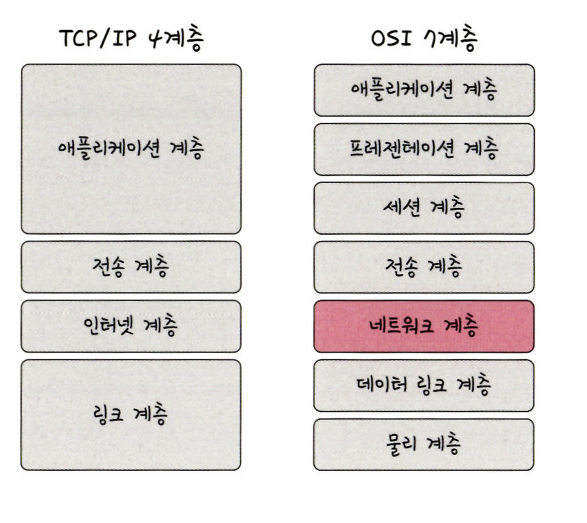
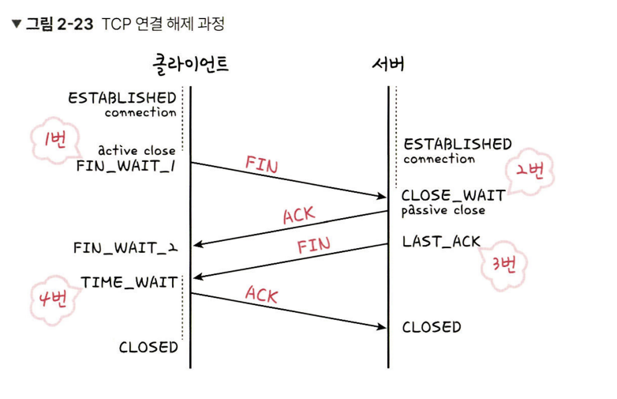
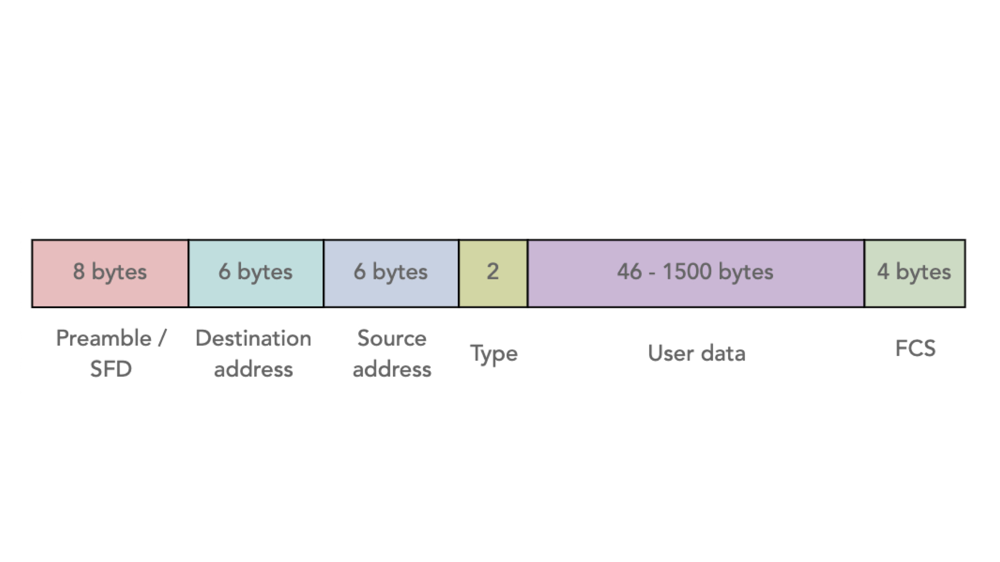

# TCP/IP 4계층 모델 

## 기본적으로 알아보기 

### 1. 인터넷 
- 인터넷이란, 전세계걸쳐 파일 전송등의 데이터 통신 서비스를 받을 수 있는 컴퓨터 네트워크 시스템을 의미한다. 

### 2. TCP/IP 흐름 

> "www.google.com"을 웹브라우저에 입력하면 무슨일이 일어날까요?

1. google web server에 www.google.com(:80)으로 http로 작성된 해당 요청을 처리해달라는 request메세지를 보낸다. (:80)은 80 포트 
2. 해당 요청을 구글 서버로 보내기 위해 패킷을 만들어야 한다. 패킷에는 각 계층에 필요한 정보들이 담겨야 한다. 
3. 여기서 HTTP, TCP, IP, ETHERNET 프로토콜을 사용한다고 생각해보자. 
4. Packet의 application layer에는 위에서 작성한 http request가 들어간다.
5. tcp 패킷의 헤더는 sp와 dp로 이루어져있다. (시작 포트와 목적 포트). 시작 포트는 컴퓨터에서 만든 소켓의 포트번호이다. 당연히 내 컴퓨터는 알고 있다. 목적지 포트는 유명하다! 80포트! 
6. IP 헤더에 대한 정보를 보자. SA, DA가 있다. 시작 IP주소는 내 IP주소이고 목적지 주소는 아직 모른다. 도메인 정보만 알고있다. 그렇지만 DNS 프로토콜을 이용해 도메인 정보로 IP주소를 알아낼 수 있다. 
7. OS는 DNS서버로 어떻게 IP주소를 알게 될까? DNS 서버 주소는 이미 컴퓨터에 등록되어있다. DNS도 Application Layer의 프로토콜이며 53번 포트를 사용한다. 
8. Ethernet 프로토콜의 헤더를 보면 MAC주소를 알아야 한다. 구글 웹서버의 MAC주소가 필요할까? ㄴㄴ. 물리적으로 연결된 우리집 공유기의 MAC주소가 필요하다. 다른 네트워크와 연결하는 gateway가 된다. 
9. ARP프로토콜은 IP주소를 MAC주소로 바꾸어주는 주소해석 프로토콜이다. 이걸 사용해서 MAC주소를 알아낸다. 

## 2.2.1 계층구조 

> TCP/IP계층과 OSI 7계층에 대해 설명하라 

4계층을 좀더 작게 쪼갠것. 
이 계층들은 특정 계층이 변경되었을 때 다른 계층이 영향을 받지 않도록 설계되었다.
두 계층 모두 데이터 통신을 표현한 계층이긴 하지만 OSI 7계층은 데이터 통신에 필요한 계층과 역할을 정확하게 정의하려고 한 모델이다. 그에 반해 TCP/IP 4계층은 현재 인터넷에서 사용되는 프로토콜로, 좀 더 실무적이면서 프로토콜 중심으로 단순화된 모델이라고 볼 수 있다.

> 각 계층에 대해 구체적으로 설명해보라 

1. 애플리케이션 계층 

- 실질적으로 사람들에게 제공되는 서비스가 돌아가는 층이다. 웹서비스, 이메일등이 여기에 있다. 
- 애플리케이션 계층에는 FTP, SSH, HTTP, SMTP, DNS와 같은 프로토콜이 있다. 
  - FTP : 장치와 장치 간의 파일을 전송하는데 사용되는 표준 통신 프로토콜
  - SSH : 보안되지 않은 네트워크에서 네트워크 서비스를 안전하게 운영하기 위한 암호화 네트워크 프로토콜 
  - HTTP : www을 위한 데이터 통신의 기초이자 웹사이트를 이용하는데 쓰는 프로토콜
  - SMTP : 전자메일 전송을 위한 인터넷 표준 통신 프로토콜
  - DNS : 도메인 이름과 IP주소를 매칭해주는 서버이다. 

2. 전송계층 

- 송신자와 수신자를 연결하는 통신 서비스를 제공하며 연결 지향의 데이터 스트림 지원, 신뢰성, 흐름 제어를 제공하며 애플리케이션과 인터넷 계층 사이의 데이터가 전달될 때의 중계역할을 한다 
- TCP, UDP가 있다. 
  - TCP : 연결지향형 프로토콜이다. 패킷 사이의 순서를 보장하고 연결지향 프로토콜을 사용하여 신뢰성을 구축해서 수신여부를 확인한다. 가상회선 패킷 교환방식을 사용한다.   
  - UDP : 순서를 보장하지 않고 수신여부를 확인하지 않는다. 단순히 데이터만 주는 데이터그램 패킷 교환 방식을 사용한다. 서로 다른 경로로 데이터가 움직이기 때문에 데이터가 순서대로 도착하지 않는다. 

3. 인터넷 계층 

- 장치로부터 받은 네트워크 패킷을 IP주소로 지정된 목적지로 전송하기 위해 사용되는 계층이다. 
- IP, ARP, ICMP등이 있다. 수신상대의 주소를 지정하여 데이터를 전달한다. 

4. 링크계층 (네트워크 접근 계층)

- 전선, 광섬유, 무선 등으로 실질적으로 데이터를 전달하며 장치간에 신호를 주고받는 규칙을 정하는 계층이다. 

> 유선 LAN에 대해 설명해봐라 

A. 유선 랜을 이루는 이더넷은 IEEE802.3이라는 프로토콜을 따르며 전이중화 통신을 쓴다

전이중화 통신이란 양쪽 장치가 동시에 송수신할 수 있는 방식을 말한다. 

CSMA/CD란 유선 LAN에 반이중화 통신을 할때 썼던 방식이다. 이 방식은 데이터를 '보낸 이후' 충돌이 발생한다면 일정 시간 이후 재전송하는 방식을 말한다. 

> 무선 LAN에 대해 설명해봐라 

A. 무선 LAN장치는 수신과 송신에 같은 채널을 사용하기 때문에 반이중화 통신을 사용한다. 

반이중화는 양쪽 장치는 서로 통신할 수 있지만 동시에는 통신을 못하는 방식을 의미한다. 

CSMA/CA는 반이중화 통신중 하나로 데이터를 보내기 전에 캐리어 감지등으로 사전에 가능한 충돌을 방지하는 방식을 사용한다. 

1. 데이터를 송신하기 전에 무선 매체를 살핀다 
2. 캐리어를 감지하여 회선이 비어있는지를 확인한다. 
3. IFS: 랜덤 값을 기반으로 정해진 시간만큼 기다리며, 만약 무선 매체가 사용중이면 간격을 늘리며 기다린다. 
4. 이후 데이터를 송신한다 

무선 신호 전달 방식을 이용하여 2대 이상의 장치를 연결하는 기술이다. 

> 무선 LAN의 기술 종류에 대해 설명해봐라 

A. 와이파이, BSS, ESS가 있다 

- 와이파이는, 전자기기들이 무선 LAN신호에 연결할 수 있게 하는 기술로 이를 사용하려면 무선 접속 장치(AP)가 있어야한다. 흔히 이를 공유기라고 한다. 이걸로 유선에 흐르는 신호를 무선으로 바꿔준다. 
- BSS는 기본 서비스 집합을 의미한다. 단순 공유기를 통해 네트워크에 접속하는 것이 아닌 동일 BSS내에 있는 AP들과 장치들이 서로 통신이 가능한 구조를 말한다. 
- ESS는 하나 이상의 연결된 BSS그룹이다. 장거리 무선통신을 제공하며 더 많은 가용성과 이동성을 지원한다. 

> 3-way handshake에 대해 말해보아라. 

TCP계층은 데이터를 보내기 전에 송신측과 수신측이 서로 연결되는 작업이 필요하다. 이 작업을 3-way handshaking이라고 한다. 
3-way hadshake는 TCP의 신뢰성을 확보할 때 사용한다 

이 과정에 필요한건 헤더에 달려있는 컨트롤 비트이다. (URG, ACK, PSH, RST, SYN, FIN)
과정은 다음과같다. 

SYN : 클라이언트가 서버에게 연결 요청해달라고 표시하는 것 

1. SYN 단계 : 클라이언트는 서버에 클라이언트의 ISN을 담아 SYN을 보낸다. ISN은 새로운 TCP연결의 첫번째 패킷에 할당된 임의의 시퀀스 번호를 말하며 이는 장치마다 다르다 
2. SYN + ACK 단계 : 서버는 클라이언트의 SYN을 수신하고 서버의 ISN을 보내며 승인번호로 클라이언트의 ISN + 1을 보낸다 
3. ACK단계 : 클라이언트는 서버의 ISN + 1한 값을 승인번호로 담아 ACK를 서버에 보낸다. 

이 과정 이후 신뢰성이 구축되고 데이터 전송을 시작한다. TCP는 이 과정이 있어서 신뢰성이 있는 계층이라고 하고, UDP는 이 과정이 없기 때문에 신뢰성이 없는 계층이라고 한다. 

> 4-way handshake 에 대해 설명해라 

TCP가 연결을 해제할 때 수행해야하는 과정이다. 

1. 클라이언트가 서버로 연결을 종료하겠다는 FIN 플래그를 보낸다. 
2. 서버는 ACK라는 승인 세그먼트를 보낸다. 자신의 통신이 끝날때까지 기다린다.(close_wait)
3. 서버가 통신이 끝나면 클라이언트로 FIN이라는 세그먼트를 보낸다
4. ACK를 보내서 (확인의 의미) CLOSED상태가 된다. 클라이언트는 TIME-WAIT상태를 유지하다가 close를 때린다. 
 
> TIME_WAIT을 하는 이유는?

서버에서 FIN을 보내기 전에 보낸 잉여패킷이 클라이언트에 도착하지 않았을 수 있기 때문이다. 그래서 TIME_WAIT을 주는 것이다(데이터 무결성 문제 해결)
또한 두 장치가 연결이 닫혔는지 확인하기 위해서이다. LAST_ACK상태에서 닫히게 되면 다시 새로운 연결을 할 때 장치는 계속 LAST_ACK로 되어있기 때문에 접속 오류가 나게 된다. 

TIME_WAIT 시간은 OS별로 조금씩 다르다. 

> 이더넷 프레임에 대해 설명해라 

데이터 링크 계층에서 한다. 이더넷 네트워크에서 주고받는 프레임이다. 송신 과정에서는 캡슐화를 거친다. 

프림블~타입 까지가 헤더, 페이로드가 데이터, FCS가 트레일러이다. 

> MAC주소에 대해 설명해라 

- 물리적 주소라고도 불린다
- 일반적으로 고유하고, 일반적으로 변경되지 않는 주소를 말한다. (근데 고유하지 않을수도 있고 주소가 변할수 있는데 특수케이스이다)
- MAC주소는 네트워크 인터페이스마다 부여되는 6바이트 길이의 주소이다. 

> 이더넷 프레임의 타입/길이에 대해 설명해라 

- 타입 혹은 길이를 명시한다 
- 필드에 명시된 크기가 1500이하일 경우 : 이 필드는 프레임의 길이 
- 필드에 명시된 크기가 1536 이상일 경우 : 이 필드는 타입이다 
  - 타입이란? : 이더타입이라고도 하며, 어떤 정보를 캡슐화 했는지를 나타내는 정보이다 0800 -> IPv4 / 86DD -> IPv6 / 0806 -> ARP 

> 계층간 데이터 송수신 과정을 설명해라. 

요청값들이 캡슐화 과정을 거쳐 전달되고 다시 비캡슐화 과정을 거쳐 전송이된다. 

애플리케이션 계층의 데이터가 전송 계층으로 전달되면서 세그먼트, 또는 데이터그램화 되며 TCP(L4)헤더가 붙게 된다. 인터넷 계층으로 가면서 IP(L3)헤더가 붙으며 패킷화 된다. 이후 링크 계층으로 가면서 프레임 헤더와 트레일러가 붙어 프레임화가 된다. 비캡슐화는 이 순서가 거꾸로 가면서 하나씩 까지는 것. 

> 이더넷 방식 외 기술은 없나 ? 

- 토큰링 방식이 있다. 
- 토큰링 네트워크에서는 호스트들이 고리 형태로 연결되어 있으며, 호스트낄이 돌아가며 토큰이라는 특별한 정보를 교환한다. 네트워크 내 다른 호스트에게 메세지를 송신하려면 반드시 이 토큰을 가지고 있어야 한다. 

## 2.2.2 PDU

> PDU가 무엇인가?

A. PDU란 어떤 계층에서 계층으로 데이터가 전달될 때 한 덩어리의 단위를 의미한다. 
PDU는 제어 관련 정보들이 포함된 헤더, 데이터를 의미하는 페이로드로 구성되어 있으며 계층마다 부르는 명칭이 다르다!

- 애플리케이션 계층 : 메시지
- 전송계층 : 세그먼트(TCP), 데이터그램(UDP)
- 인터넷 계층 : 패킷
- 링크 계층 : 프레임(데이터링크계층), 비트 (물리 계층)

