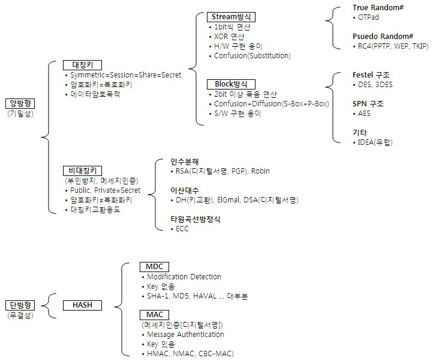

# 2.5 HTTP

## 2.5.1 HTTP/1.0

> HTTP/1.0에 대해 설명하라 

- 한 연결당 하나의 요청을 처리하도록 설계되어 있다. 
- 서버로부터 파일을 가져올 때 TCP의 3-way handshake를 계속해서 열어야 하기 때문에 RTT가 증가한다. 

> RTT란 무엇인가?

- 패킷이 목적지에 도달하고 나서 다시 출발지로 돌아오기까지 걸리는 시간이며 패킷 왕복 시간을 의미한다.

> RTT증가 해결 방법을 설명해라 

- 이미지 스플리팅 : 많은 이미지가 합쳐진 하나의 이미지를 다운로드 받고, 이를 기반으로 background-image의 position을 이용하여 이미지를 표기하는 방법이다. 

- 코드 압축 : 코드를 압축해서 개행문자, 빈칸을 없에고 코드의 크기를 최소화 하는 방법이다. 

- 이미지 base64인코딩 : 이미지파일을 64진법으로 이루어진 문자열로 인코딩하는 방법이다. 데이터가 더 커지는 단점이 있다. 

## 2.5.2 HTTP/1.1

> HTTP/1.1에 대해 설명을 해라 

- HTTP/1.0에서 발전한 것이며 한번 TCP를 초기화 한 이후에 keep-alive라는 옵션으로 여러개의 파일을 송수신할 수 있게 되었다. 
- TCP -handshake를 한번 하면 get-response를 여러번 하고 닫을 수 있음 
- HTTP/1.0에서도 있긴 있었으나 표준화 되어있지 않았기 때문에 차이가 있다. 

> HOL Blocking에 대해 설명하여라 

- 네트워크에서 같은 큐에 있는 패킷이 그 첫번 째 패킷에 의해 지연될 때 발생하는 성능 저하 현상. 

## 2.5.3 HTTP/2

> HTTP/2에 대해 설명하라 

- HTTP/1보다 지연시간을 줄이고 응답시간을 더 빠르게 할 수 있다
- 멀티 플렉싱 : 여러개의 스트림을 사용하여 송수신한다. 특정 스트림의 패킷이 손실되었다고 하더라도 해당 스트림에만 영향을 미치고 나머지 스트림은 멀쩡하게 동작한다. 
  - 병렬 처리는 HOL Blocking문제를 해결 할 수 있다. 
- 헤더 압축 : HTTP/1.x는 헤더가 크다. HTTP/2에서는 헤더 압축을 통해 이를 해결하는데 허프만 코딩 알고리즘을 사용하는 HPACK압축 형식을 가진다. 
  - 허프만 코딩 : 문자열을 문자 단위로 쪼개 빈도수를 세어 빈도가 높은 정보는 적은 수의 비트수를 사용/ 낮은 정보는 비트 수를 많이 사용 -> 전체 데이터 표현에 필요한 비트 양을 줄이는 원리이다. 
- 서버 푸시 : 클라이언트 요청 없이 서버가 바로 리소스를 푸시할 수 있다. 
- 요청의 우선순위 처리를 지원 : 

## 2.5.4 HTTPS

- 통신을 암호화한다. 
> SSL/TLS 에 대해 설명하라

- SSL/TLS는 전송 계층에서 보안을 제공하는 프로토콜이다. 클라이언트와 서버가 통신할 때 제 3자가 메세지를 도청하거나 변조하지 못하도록 한다. 

- 인증 메커니즘 :
- 키 교환 암호화 알고리즘 
- 해싱 알고리즘 

> 보안세션에 대해 말해라 

- 보안이 시작되고 끝나는동안 유지되는 세션을 말하고 SSL/TLS는 핸드셰이크를 통해 보안 세션을 생성하고 이를 기반으로 상태 정보 등을 공유한다. 

- 클라이언트와 서버가 키를 공유하고 이를 기반으로 인증, 인증 확인등의 작업이 일어나는 한번의 1-RTT가 생긴 후 데이터를 송수신하는 것을 볼 수 있다 
- 사이퍼 슈트(cypher suite)를 서버에 전달하면 서버는 받은 사이퍼 슈트의 암호화 알고리즘 리스트를 제공할 수 있는지 확인한다. 

> 인증 메커니즘에 대해 말해라 

- 인증 메커니즘은 CA(Certificate Authorities)에서 발급한 인증서를 기반으로 이루어진다. '공개키'를 클라이언트에 제공하고 사용자가 접속한 '서버가 신뢰'할 수 있는 서버임을 보장한다. 인증서는 서비스 정보, 공개키, 지문, 디지털 서명으로 이루어져있다. 

> 암호화 알고리즘에 대해 말해라 

- 두개 다 디피-헬만 방식을 근간으로 만들어졌다. 
  - 암호키를 교환하는 방식이다.공개 값과 각자의 비밀키를 혼합하여 그 값을 공유한다. 그걸 다시 각자의 비밀키와 혼합하면 공통의 암호키가 만들어진다. 
- 대수곡선 기반의 ECDHE
- 모듈식 기반의 DHE

> 해싱 알고리즘에 대해 말하라 

- 해싱 알고리즘은 데이터를 추정하기 힘든 더 작고 섞여있는 조각으로 만드는 알고리즘이다. 
- SHA-256은 어떤 값을 넣어도 함수의 결과 값이 256비트의 값으로 나오게 된다. 

> SEO와 HTTPS에 대해 설명해라 

- SEO는 검색엔진 최적화를 뜻하며 사용자들이 구글, 네이버같은 검색엔진으로 웹사이트를 검색했을 때 그 결과를 페이지 상단에 노출시켜 많은 사람이 볼 수 있도록 최적화하는 방법을 의미한다. 

## 2.5.5 HTTP/3

> HTTP/3에 대해 설명하라 

- TCP 위에서 돌아가는 HTTP/2와 달리 QUIC라는 계층에서 돌아간다. TCP기반이 아닌 UDP기반으로 돌아간다. 
- 또한 HTTP/2의 멀티플렉싱 장점을 가지고 있으며 초기 연결 시 지연시간 감소라는 장점이 있다. 

> 지연시간 감소에 대해 설명하라 

- HTTP/3의 QUIC는 TCP를 사용하지 않기 때문에 3-way handshake를 거치지 않아도 된다. 
- QUIC는 순방향 오류 수정 메커니즘이 적용되었다. 이는 전송한 패킷이 손실되었다면 수신 측에서 에러를 검출하고 수정하는 방식이다. 